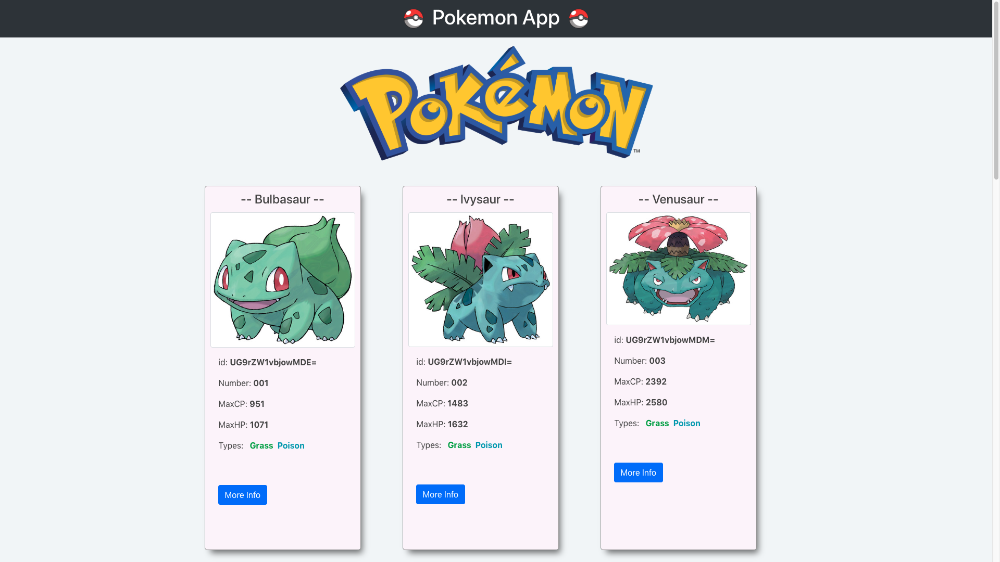
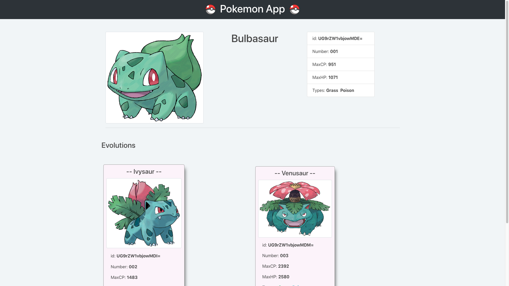

# pokemon-app
###Description
An app that fetches a GraphQL api of Pokemon Data. Built with React and Apollo.

View demo:
https://pokemon-app-gpg.herokuapp.com/




### Prerequisite
* node
* npm

## Quick Start
Clone repository

``` bash
cd ./repositorypath

npm install

npm run start

```
